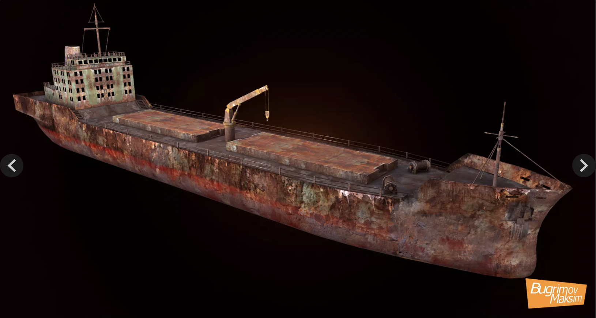
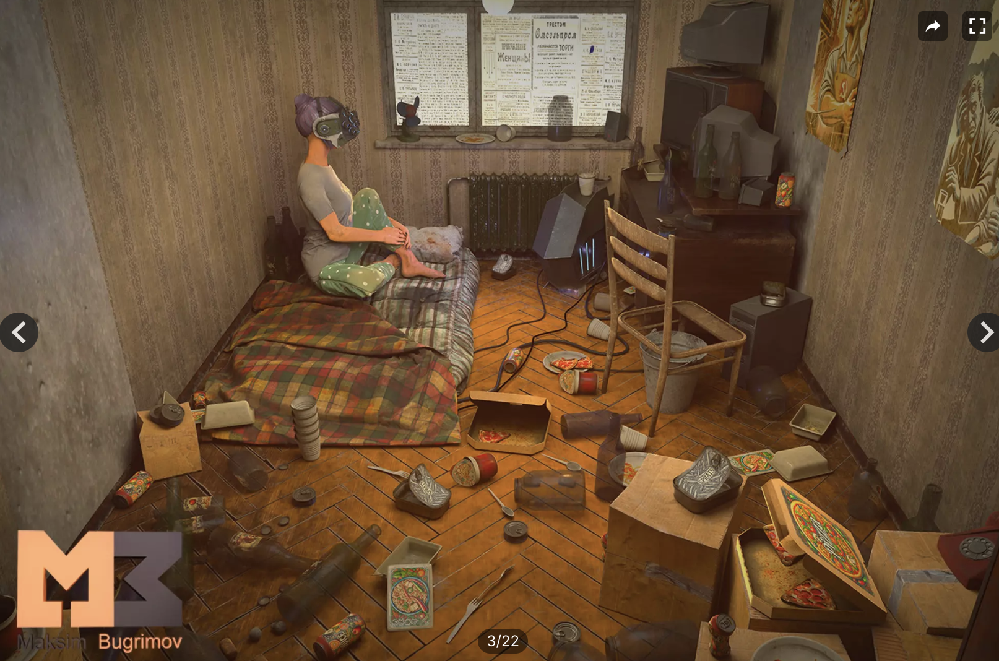
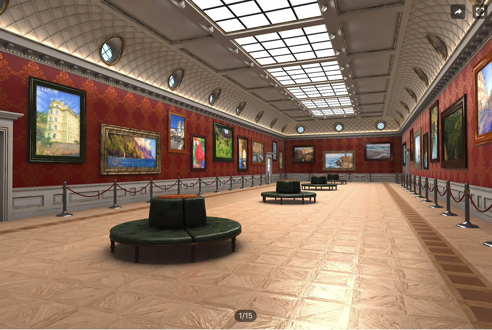

# Process journal

## Beginnings (6 July 2026)

Well I finished *Chesses 4* last week and it's Summer and why not start making something else? I'd told myself I should make something that stretches me more and is outside my comfort zone, but I'm really drawn to this idea of making *v r solo* as I think of it, which is a solo show of a single Unity Asset Store creator. In my case this very obviously has to be Maksim Bugrimov, because he's just a big favourite of mine.

I wrote to Maksim a while back to ask if he was interested in collaborating on this in some way, but I've not heard back and I really, *really* want to make the project anyway, so the plan is "just" to buy the assets for the show and show them, and hope for his blessing or at least indifference. In a way it's funnier if he's not involved because then I'm really just "making a game" with those assets in the "normal way" except that the game is a show of the assets... I do quite like a lot about it. I'm sort of both art collector and curator. Or my own collection. Of things that anyone else can have for a few bucks.

I spent some time hoping I could adapt one of Maksim's pieces for the actual gallery space itself as I don't think I want to return to the Marfa artillery sheds for this one. He has quite a good tanker in his [Apocalypse Pack](https://assetstore.unity.com/packages/3d/environments/industrial/apocalypse-pack-58281) that I pondered setting the exhibition on the deck of...

But it feels too gimmicky, a bit too distracting from the core premise of a space to look at his work *as art* rather than as part of a game. If I have a tanker with a bunch of his monsters on it, for instance, it'll end up just looking like an apocalypse game weirdly made. He also has a really weird and surprising [Geek Room (With Gerl)](https://assetstore.unity.com/packages/3d/environments/industrial/geek-room-with-gerl-323723) which caught my fancy for a little while...

But it falls into the same gimmick trap. I was imagining scaling the player and other asssets down to be tiny and exhibited around the floor of the room with this gigantic woman towering over the scene etc. And... well I think that would have had a really interesting and worthwhile aesthetic punch, but it would again have felt confusing in terms of the "this is art" pitch because it goes too far into the weirdness of it all.

So in the end I scoured the asset for for things like "gallery" and "museum" to find something that would give off the right odor of art world and "looking at art here" and settled in the end (I think?) on this one by LaikaBossGames called [Art Gallery Expo](https://assetstore-fallback.unity.com/packages/3d/environments/art-gallery-expo-178344#description) which has an august and serious and old-timey sensibility...

I'm pretty convinced by this (at the moment). I think that a space that's more of an old fashioned museum like this is going to work quite well with Bugrimov's generally apocalypse-y monster-y aesthetics. I think if I present them in too clean a white cube it'll somehow because really boring, ... I think the pieces need a bit more personality in the architecture and surfaces to throw them into relief through a sort of conversation. I think there's something to be said almost for a sense of "natural history museum" going on with it as well.

So I'm excited by the basic premise here: Maksim Bugrimov's work in an old school museum. A solo show in the *v r* series that asks the audience to reflect even more directly on a specific creator and their work, leading directly to questions of personal style, the genius of an individual, the range of creation, and so on. I think there's a lot to like about what this can stimulate in terms of thinking about the creation and labor of games. Frankly, in the context of AI and so on, it's not a bad thing to have something focused in on an actual human. 

I *really* want to interview Maksim, ideally even on video, and have that playing somewhere in the gallery space, but that's seeming less and less likely. Which is alright, but would have been good. I do want to write some sort of short-but-good wall text that explains what I see when I look at all the work, to give it some personal context and curation. Give a shape to the project for someone coming in totally cold and not sure of what to make of it.

Also, in the spirit of "doing things differently" a bit and embracing the digital nature of the show, I *would* like to explore how to stage things in surprising ways as I go. Not that it should be insane, but I think the stuffy nature of the museum room should lead to some opportunities to make things uncanny or strange as well. I already quite like the idea of that tanker completely filling a room so much that you can't get into it, say (evoking a thing I did for the ZIUM back in the day called *The Available Space* where I had a giantic cube filling one of the digital gallery's rooms - lovely of Michael Berto to let me do that one). I think there might be other ideas of that. Maybe some sort of liminal space thing where one of the doors leads out into a kind of dark nothingness area with mist and a faintly visible figure or... whatever. You get the point. Some sort of fun with the creepy nature of Maksim's work and the potential involved in digital architecture. To play around with ideas I don't play around with.

The gallery/museum space above is modular so *in theory* I will be able to make multiple linked rooms and have an interesting setup to work with (could even do one of those random teleport things or other strange spatial mappings to really mess with things geometrically?)

So that is to say that another layer on top of "exhibit Maksim Bugrimov" is "Pippin playing with those assets and the idea of museum space for his own enjoyment" as well, which will make the project that much more fun to work on for a while as these *v r*s always seem to take a hell of a lot longer than I expect or want.

I *am* a bit worried about immediately running into frustrating stupidies and the whole thing just "not working" for some technical reason, but I think the best thing is probably to buy the museum and dive in (I already own some of Maksim's monsters and his Dead Man in the Bag) so I can play with those and then buy other stuff as I go along. 

Along the way I need to think a bit further about what it means to exhibit these things, what I'm trying to show, how much text to include, whether there should be an audio guide (that would be fun let's face it), and so on. Do I buy Geek Room With Gerl? Funny thing to step into suddenly? But probably linking it up would be absolutely hellish? But I dunno, could just be really funny, will see, it's just money man.

Shades of *v r 1* returning here actually I think in terms of asking some questions about different kinds of representations of the material that reveal something about their nature.

I'll reach out to Maksim again as well. Here we go.

## Realities (8 July 2026)

Yesterday and today spent time (with Felix!) getting some things into Unity. Specifically I bought the gallery asset as discussed, experimented with putting it side by side to create multiple spaces (with the doorways provided, deleting the doors for now), added a couple of existing assets of MB's I already have (Dead Man in the Bag and Humanoid Creatures Pack), produced a WebGL build, baked lighting, and so on. Some images:

Some key takeaways so far...

### Size

As with *v r $4.99* size will presumably be a live issue. MB's work is pretty heavy stuff and the more I include the bigger the resulting museum will be in those terms. The base level build of just the museum is sitting around 55MB but as soon as I added the Humanoid Creatures Pack monsters we jumped all the way up to almost 250MB. It's a bit tough to know how to face up to that - there must be a way of dealing with such enormous file sizes, but what is it? The more included, the more unweildy it gets, and at some point it's hard to think it'll be reasonable to have it as a web build, which I would really like to hold onto. I could look into hosting elsewhere to maybe get access to server gzipped files? I could also look at greater forms of compression in the application itself... and so on.

### Lights

I've oscillated the project between realtime and baked lighting a couple of times. Amazingly the baking works for now which is weird and kind of cool, so I'll look at whether I can preserve that as I like the idea in general for the project and it sort of "makes sense" somehow? Maybe that's nonsence actually, but I like the idea.

The default setup for lighting is maybe a bit inflexible. As far as I can tell the gallery model doesn't have a real ceiling, so inside the room is just being lit more or less by the sun, which is fine, but does mean certain kinds of darkness or specific lighting approaches wouldn't be possible. This is kind of connected to...

### What is this again?

In putting together an actual museum space (well, buying one) and putting a couple of MB works in it, I'm confronted by the reality of this thing. A dead man in the bag in a well lit room, scaled up, not scaled up, a monster standing in a room, five monsters in a room... it's a bit hard to exactly say what I mean here, but the facts of the case are landing and I suppose it's typical that this bounces me back out to the level of: what is this supposed to be again? I suppose it's me looking at this thing and wondering: is this what I want?

Which I suppose is me saying, a little bit, well no... it doesn't feel like it. Some of this is sitting in front of it with Felix who is a great companion but has totally different objectives to me, being seven - he wants weird stuff to happen, wants to run around the museum, wants things to be upside down, to repose a monster, etc. Which is fun and does open up ideas (I had never really explored reposing a character model and it's easier than I'd thought at least for the primitive uses I might ever have). But it also avoids or causes me to miss some of the more principled ideas about this as an exhibition and what my objective really is.

### Monstrous

I'm also being accosted by the nature of MB's work generally speaking which is dark and scary and horror-leaning. Because of that I find myself thinking of images of creatures walking up and down the gallery space, say, or of a view through a doorway of a misty, liminal space with some creepy thing outlined, or a dark room where you can see something moving, etc. etc. That is, the pieces themselves suggest settings...

But at some point that's turning this into a kind of "horror museum" almost, where my objective is shifted toward exhibiting this assets "in context" so that I'm kind of using them "as intended". Which is not wrong, but is kind of less museum-y? A bit Museum of Natural History, which isn't necessarily bad, but I wonder if I start occluding the point of *exhibiting* them instead of just making a scary game with them.

I *do* think there's a halfway point in this, where I make a museum *about* scares (something I've thought of before), where each repeated museum room is another kind of interpretation of horror and scariness in the context of games, using MB's models as a conduit for the graphical/animated elements of this. Buuuuut... that doesn't seem like a solo show about a specific asset creator to me?

I similarly had a mechanical idea where there would be a monster following you (slowly, It Follows style) as you looked at the show and you would I guess die if it reached you but... similarly that's pretty distracting from the idea of "look, MB makes these works, appreciate them"?

### Cubes

Part of the point of a museum is to take something *away* from its context and meaning so that you can look at it in a different way - that's been the project of many of the v r games, I suppose all of them. Providing space for contemplation outside the mechanics and urgencies and feelings of *games*. The more I lean into horror, or *using* the assets, the more I'm going to be distracting from what I think the point is.

Which is to say that I would probably like to try to make a horror game set in a museum that is an exhibition of scares, but that's not what I should do now. What I should do now is think about the forms of appreciation and contemplation that make sense.

*For example* just in this moment I think of animation (MB animated the monsters) and that makes me think of *slow motion* as a way to appreciate the motion. I've also thought about a creature just walking around, which maybe rides the line of a scary room and the ability to just approach and contemplate.

I thought, too, while looking at one of the creatures with Felix really close up and finding it had little eyeballs on it I hadn't noticed, that detail is really important, so perhaps those sorts of zooms and stuff are a good idea as well, or... well something.

Anyway, I suspect I don't need to grossly overcomplicate this. I'm trying to *display* these assets, provide information about them, and provide a bit of reflection on my own part. There are interesting possibilities for displaying them: a crowd of the same monster, the shadow of a monster, a well-lit monster, a dark room with a monster, an animated monster, etc...

I suppose I should write a kind of curation document where I start thinking a bit more seriously about the display strategies, possibly exactly in that kind of taxonomic approach. (Oh I could strip textures from one at some point to reveal just the pure model.)

So yes, let's get a bit taxonomic next. Write a curation document.
