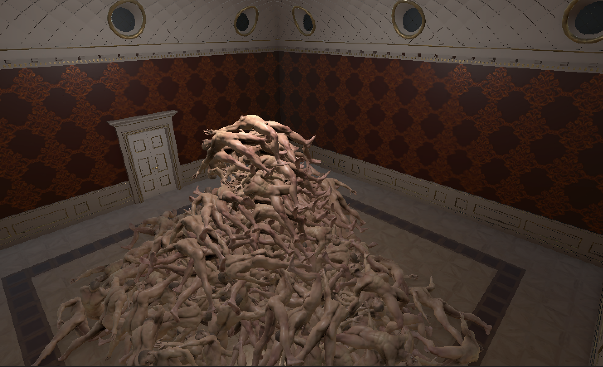
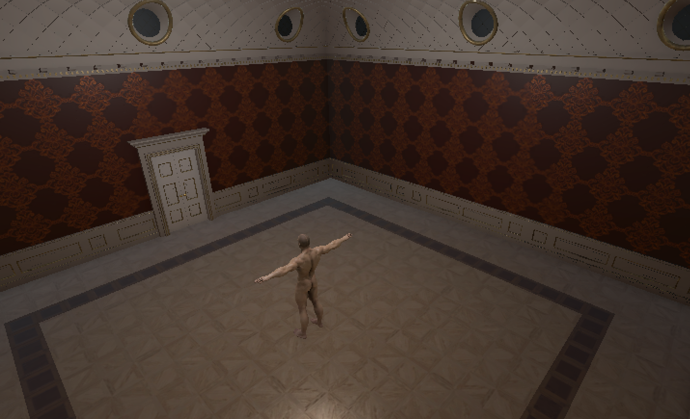
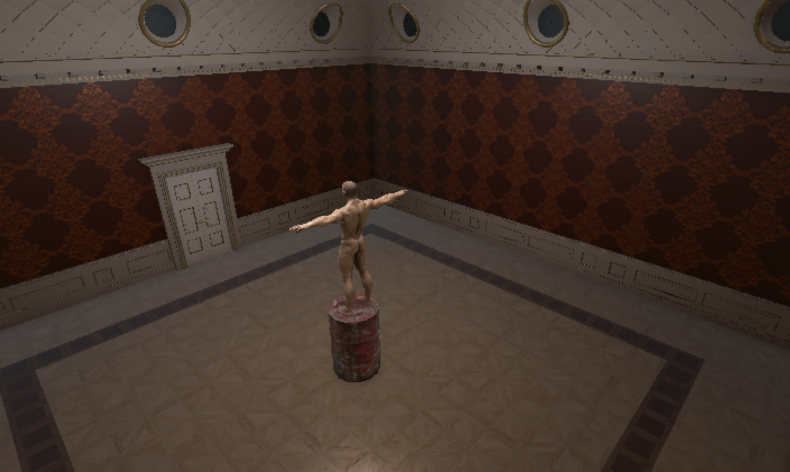
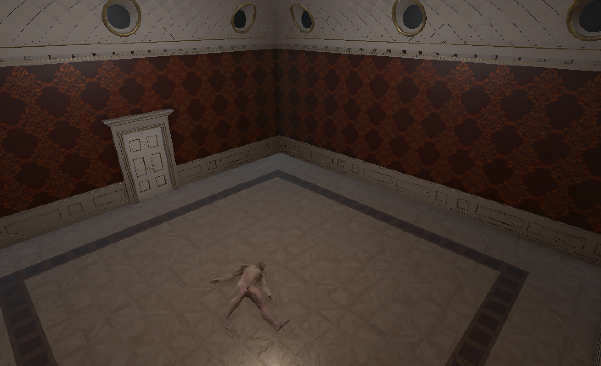
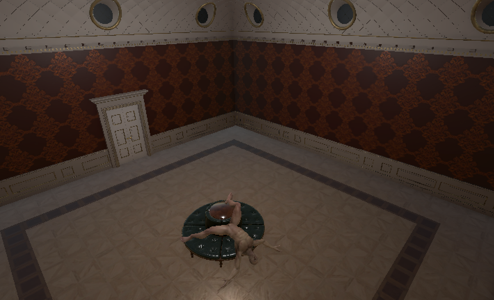
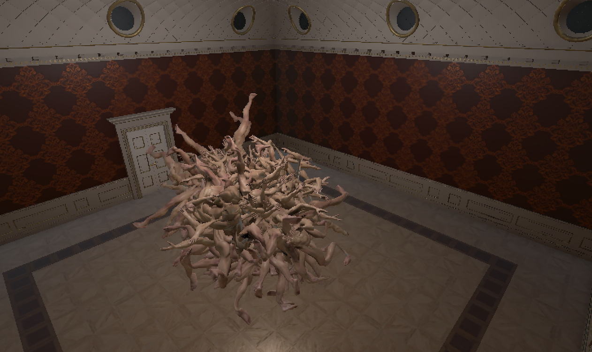
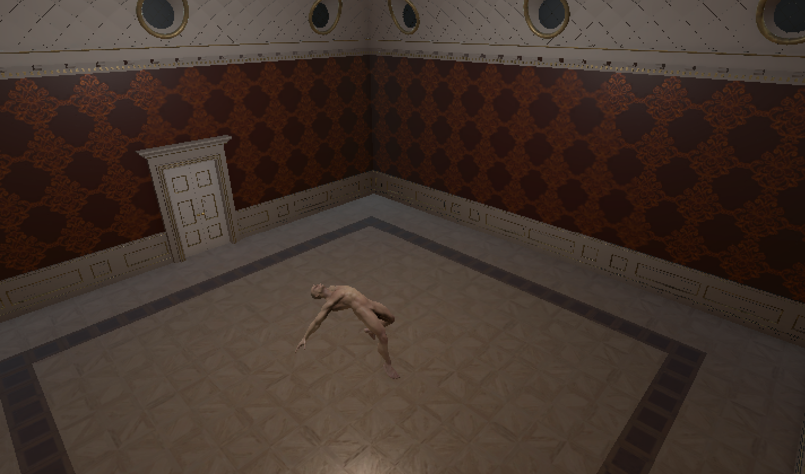
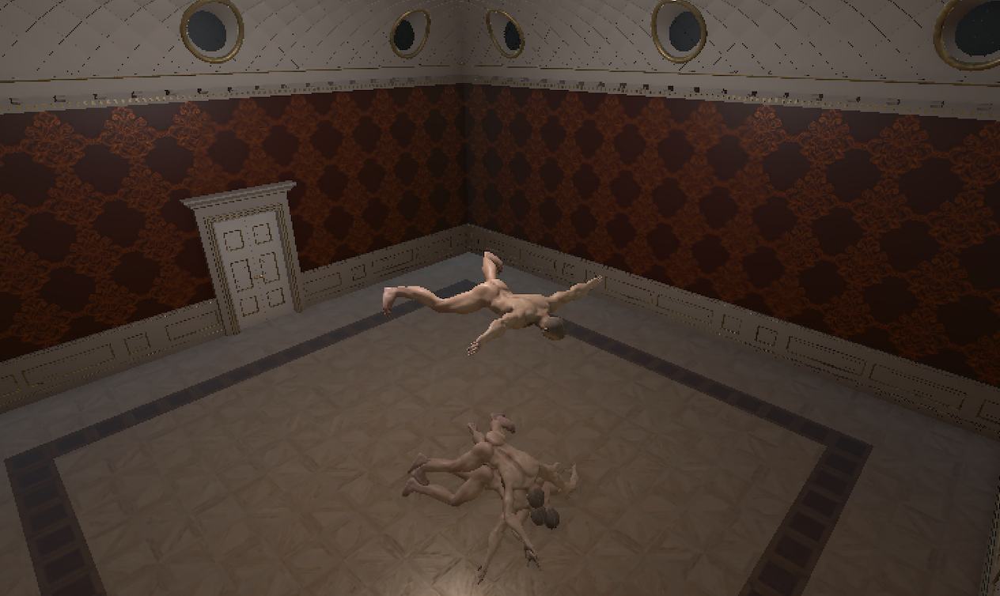
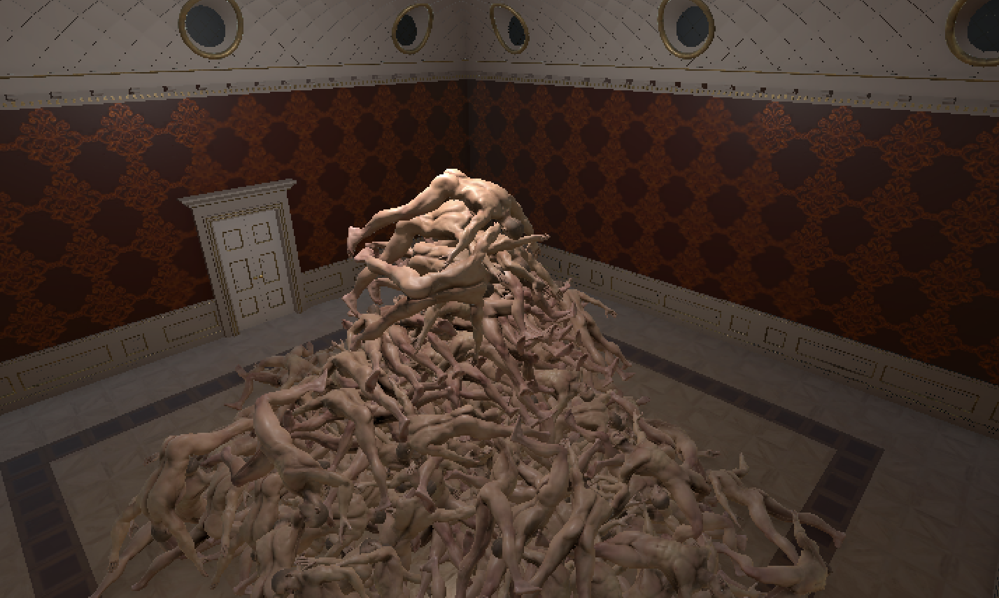

# Mazmo Script

Wherein I try to write a script for the voiceover for Mazmo.

## Thought: Just ad lib about each thing from some bullet points (24 August 2026)

### Final

- The nature of v r 6, museum space from a kit called Art Gallery Expo by LaikaBossGames. $19.
- Maksim Bugrimov, v r $4.99 and the creatures, Dead Man in the Bag, Base Man
- The question of how to exhibit a solo asset creator, the decision to play with the presentation
- I had a vision of the base man as a kind of fellow audience member, standing deep in thought in front of a painting, finger resting on his lips
- Falling in love with a base man -- the possibilities of a person

### T-pose

- Was in the corner near the door
- Base Man, Wicked Man, Having or showing a lack of decency; contemptible, mean-spirited, or selfish; Being a metal that is of little value; 
- Value. Base Man was free.
- Base man is ripped, white passing, clean shaven, clipped toenails...
- Who is he?

### Barrel

- I put him on a barrel to increase his gravitas
- Sculptural, visions of a whole sculpture section, Don Driver, Late for Meeting car ride
- Calvin and Felix, seeing his butt, his privates, the nude, Robert Yang's offer of a dick rig

### Rag man on the floor

- Rag dolls are a fascination, Rag Doll Kung Fu, a more human body
- Dropping him from a height onto the floor, watching him settle down
- A dead body, a Dead Man not in the bag, less mystery, less creepy, just a body, nothing more to reveal

### Rag man on the sofa

- Wanting a more complex pose, the museum space came with a sofa, dropped him onto it
- His head would sometimes wobble back and forth
- He looked sexualized when he fell on his back, legs akimbo, less dead, inviting but uncomfortable

### Rag Orb

- Wanted a pile of men, the power of numbers
- Copied and pasted the man in the same place 50 times, 100 times and ran the game, simulated the physics
- The shock of the orb, memories of the creature at the end of Inside, the genuinely freaky creature in the Russian antarctic borehole movie The Superdeep, The Thing
- Horror in superposition and physics

### Orbman Isolated

- Accidentally missed deleting a single man from a man pile and he was beautiful
- This one isn't the one I saw, this is a different one but I tried to capture the same kind of rapturous impossible post (the other was as if in mid knee slide, this one more contemporary dance move)
- Ragdolls and base men and the possibilities of movement and dance

### Dripfeed men

- The orbs were too hard to control, sprayed men everywhere
- Developed a system to drip men onto the ground one by one, watching them pile up in dissatisfying ways, creating stacks that would tip and fall
- Ran into trouble with copying too many rag men at once just not working
- Had to develop a system for manipulating them while the scene was running, deleting joints and rigidbodies and then copying them now that they were less complex
- Building systems for building piles of base men

### Fuckpile builder

- The final version involved building a pile more manually to get a satisfying peak in the middle, dragging men around to adjust them
- Man as clay, flopping around obligingly, weighing nothing to me
- Then I could freeze the growing pile and accumulate the men

### Final again

- And so I ended up with my pile of men, a sculpture, one way of seeing a base man
- But I'm in love, I want to make an entire museum of the base man, every way I can use him, work with him, manipulate him, drop him, stretch him
- Musical tone at the end to indicate the ending

---

## Thought: Read aloud from process journal (7 August 2026)

That would be one way to do it. Maybe without explanation? Let me pull some quotes and see what it could be like?

### 1. T-pose

(Maybe he shouldn't be in the corner?)

> A naked man of 43.7MB from 2021, recipient of the great review:

> 

> I enjoy how straightforward he is on the one level, but he's also very obviously like a ripped white man. Very generic facial features, etc. Who is he? (Who are any of these people? How does Maksim think about the character behind the mesh I wonder? How much is he injecting versus leaving to the next person in the cycle?)

> How do you display a naked (no penis) man in a room in a way that's interesting, not evoking just looking maybe at an anatomical "thing"?

### 2. Idle

> Maybe an idle animation?

### 3. Barrel

> I had a sculpture with him on a barrel I was quite fond of, but I think it's headed in a different direction there.

### 4. Sofa

> I also had him ragdoll-fallen onto a sofa and his head would rock back and forth which was quite intriguing.

> Anyway his ordinariness is probably an opportunity to display him in a strange way.

> Increasingly thinking I don't need/want to go the route of trying to display things to their "advantage" but rather to display them in an "interesting" way and to rely on the player/audience to look at them as a part of that... in a way to make the strangeness of the setting be something that *causes* you to want to look at them more closely, or to acknowledge the artificial while also making room to have a feeling about it.

### Pile

> My starting ploy is to make a big pile of them and see if that feels like something. I created a rag doll prefab of the guy and then superimposed 100 of them floating above the floor then hit play. They turned into an INCREDIBLE monster of flailing strange limbs that was frankly kind of freaky and just like a horror movie as the engine figured out how to resolve all the bad and fucked up physics involved. Eventually it subsided into a whole lot of base men lying on the floor and piled up and it looks... really kind of good.

> I'm tempted to try to pile them even higher if I can? Like if they could reach the ceiling that would be pretty amazing.

### Thinky face

I don't think there's enough here... I can draw on the ideas, but I think I need to retell this rather than verbatim it.

