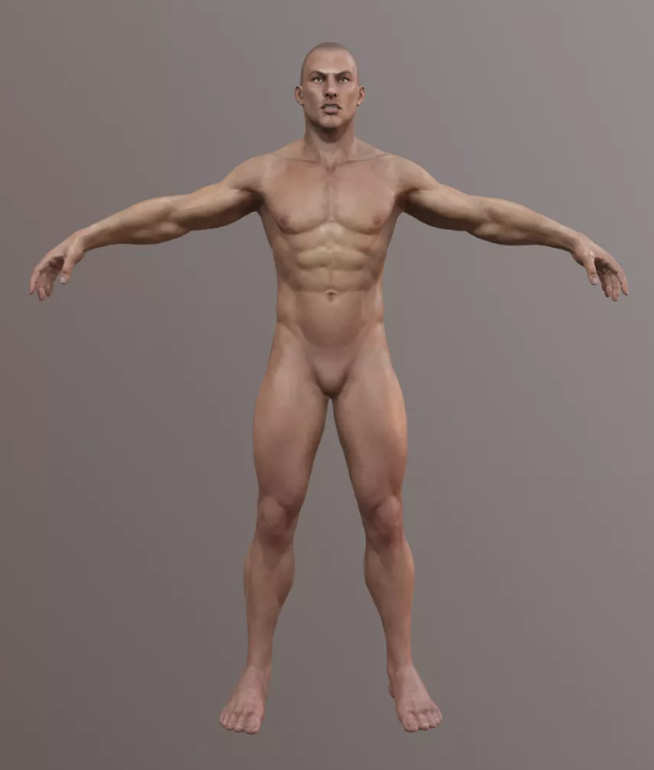
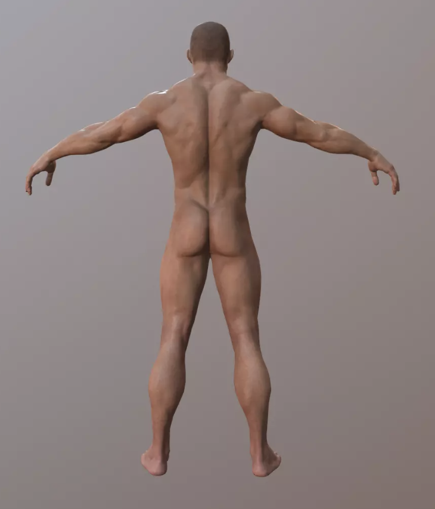
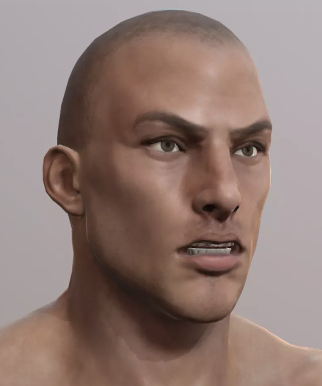

# Mazmo Thinking

## 1 (6 August 2026)

For Mazmo I need to contemplate the idea of a voice-over for that base man room:

This is time-sensitive, but also quite useful since I've been wondering about audio versus non-audio approaches for v r 6 as a whole and this would let me at least prototype it and try it out and make a decision.

Simplest idea: 
- record me rambling about Base Man and Museum as Technique per the stuff I've between writing/thinking over in the [Carte Semiotice](../carte-semiotiche/carte-semiotiche-brainstorms.md) brainstorming.
- send it to Mazmo

More sophisticated would be not to ramble but to write something down (obviously)

Dreamy would be if Maksim got back to me with his own thoughts about Base Man that I could then include.

More v r 6 ready would be not to talk about the larger project but to stick just with Base Man so that it would be something that could be injected directly into the game.

That said, including talking about the Carte Semiotiche angle would be a way for me to develop that thinking further.

And then there are of course endless opportunities for a strange, more expressive, more experimental version of all this, where it's not a straight-faced interpretation kind of thing but more a secondary performance.

The question I asked Maksim was:

> When you make a human figure like this, are you thinking about them as a real person? Who is this guy? Where is he from?

Which is not super interesting, but the question of *who* a generic human figure is something. Here he is for reference:
 

What are the things we can think about fairly easily just from his basic nature/representation in a "generic" sense

- Who is the referent?
- Why is he white?
- Why does he not have genitals?
- Is the idea that he is a Ken doll ready for dress-ups
- Why this haircut?
- Why this expression (is this the same expression he has when I use him?)
- Why so ripped?
- Nice ass.

And then there are the elements around how I worked on presenting Base Man over time (this kind of process story is a clear option *in general* for a flavour of voice over in v r 6):

- Initial base man in t-pose just in the corner of a room, like a broom, confronting and surprising when you walked in, funny to Felix
- Base man standing on a radioactive barrel as a plinth, still in T, funnier because it raised his genital area to our eyeline, let us more easily look at his butt (with Calvin), more sculptural -- this presentation actually stuck with me for a long time as a possiblity, makes me think of Don Driver's sculptures
- (The whole thing of readymades obviously has to be discussed in this context, though I'd argue Base Man is more of an artwork than a urinal? Maybe not, maybe he's just like a urinal...)
- I think the next realization around manually posing him, though I don't think I have evidence of that and might be confusing doing it with Humanoid Creature... I definitely *thought about* things like the Base Man standing in front of a painting with his hand on his chin, the idea of Base Man as a fellow museum attendee to make the place lived in, to model behaviours and feelings and thoughts...
- It has occurred to me to put Base Man inside Dead Man in a Bag's bag. I wonder if he *is* the model of that? How did Maksim make that one? If it was draping a virtual fabric on a body it could be that it is Base Man... that's something I could investigate
- (I'm already liking this process idea... it provides a way of exhibiting Base Man in many *other* ways while only having one actual display)
- After this I think we get to the realization about ragdolling, carefully setting up his bones/joints (noticing the whole naming convention but also the conflict and confusion... the sense of what it would be like to get it wrong [I should try that for the eventual next show])... I dropped him on the ground but pretty soon onto the museum sofa to get something more dynamic. It looks quite sexually suggestive - can refer to the Blue Sky post. The whole dynamics involved in a ragdoll are amazingly satisfying beyond the basic idea that someone is *dead*. It's a way to naturalistically pose a body without the craft and knowledge of an animation. It is simply a perfectly relaxed person.
- I dropped him on the sofa quite a few times searching for interesting poses. Half off, face up, face down, falling off, limbs dangling. Mostly just for the experience, not necessarily for display (though I think it does make a very good display)
- I think from here we get to the idea of multiples, the fact they are "free", even the thought about lightmaps and the sense that more bodies is somehow "getting away with something", demonstrating the power and beauty of the engine's treatment of light on bodies (which gets us to Rennaisance stuff?); so we swift have piles and distributions of bodies as the objective, and pretty early the idea of a "mound" of bodies.
- The orgy vibes, the fuckpile (M.B.), but without penises, Robert Yang's comment on me finally making a gay sex game (was that the pile or the singular man on the sofa?), the sex stuff, is he sexy? He is literally sexless, but he's kind of hot? Is he hotter for me because he doesn't have a threatening penis? He cannot fuck (me).
- (I think this is good stuff?)
- The orb of men. The placement strategy of superimposing tens, a hundred, two hundred men and letting physics sort em out. The horror imagery, the desire to capture that creature (which seemed like Inside and also that Russian horror film and also The THing). Horror and Maksim go together but not usually this body, the uncanny, the normal body made strange and scary. The ambitions to make a horror museum stemming from this kind of thing. The lag and framerate as it resolved the bodies. Multiple man orbs distributed in the room.
- A vision
    - A vision of a Mazmo context where the display changes as I talk about different ideas, different things pop into existence/instantiate
    - Alternately a vision of a Mazmo context with multiple rooms showing the evolution of the "final" display... the unsatisfactory nature of something "final"... (is it possible to display a man orb? I guess you could have a trigger where you get to watch a man orb resolve?)
- I did reach a point where I was "happy enough" with a specific pile of men to consider it a final prototype prior to building out the real museum. The idea of prototypes and the idea of refining them.
- Somewhere in that process of piles I deleted all but one of the men (to reset) but ended up with a man posed by his fall down the pile of bodies into a kind of beautiful dance pose... I could describe this pose of yeah show that pose.
- On being asked to send something over to Mazmo I revisited the pile and found it wanting, not high enough. Maybe it still isn't high enough. I'm wanting spectacle. I thought about the many men versions with invivible objects giving them a kind of a shape. A wave of men? A tunnel of men (love)? These are all the things that drive me to know I have to make a completely separate museum/game just of the Base Man and the possibilities and configurations. The dissatisfaction with a singular presentation - it's never right, we need them all and to think about them all at once, to compare them all to each other to feel their feelings.
- I used man orbs, I dropped individual men, I dropped them face down and face up and legs first, I thought about sand pile physics and that guy we met in Udaipur (Lionel Divine - write to Lionel)... this project is getting insane in a good way. I thought about how high to drop a man, I noticed how bouncy a pile of men becomes, like a trampoline through flexing of all those joints receiving force, I thought about man mass, (I *just* thought about the lack of a penis joint/bone in a standard ragdoll meaning no flopping penises unless they're custom)

- I had problems with copying a large number of men from the running scene back into the non-running scene to preserve the transforms of fallen men. I started doing partial man piles, freezing them, and then dropping further on the static men...
- I had situations where if I just kept a set of ragdol men with their joints and bodies still present, even if it looked stable it would *explode* upward  when I ran the scene again (leading to a practice of removing those parts of them to create completely static men in the poses they had fallen into)
- Once when I removed the character joints (live?) the men seemed to fall to pieces? Was that my imagination? Is that a thing? I think that happened if I removed the joints without making the bodies kinematic... makes sense, I could reproduce.
- I started dropping men onto the pile and then dragging them around a bit live to get the shape I was looking for. There was a period before that where you would drop men horizontally rotated and face down (or up) and they would literally stack upwards until they tipped over due to distribution of weight... I felt the burden of the kind of mechanical nature of things to tweak them a bit (though I didn't rotate them) so that this wasn't happening... I wanted the pile to be "naturalistic"
- Rilla thing of "raining men literally" plays into all of this and would be a clear idea for v r 7: Base Men
- (There's the whole nature of saying "Base Man" "Base Men" and the meaning of *base*... the Shakespearean read that they are *bad* men)
- That final technique above is where I am to this point.. I made a satisfyingly towering pile which was my point all along, it has something of the feel of a wave. I like the idea now that I write that of a gallery room "flooded" by men that you cannot enter for that reason.
- The Base Man also makes me think of that game Kristallyn (spelling?) which I think had a nude body doing the stuff? Think it was a women though. Using a woman would be tougher for me... the fact it is a man and I am a man makes things make sense. Likewise if it were a black body that would be troubling and impossible. Maybe this can only be done (by me) with a white man's body, maybe only with this kind of generic muscular man? The least problematic form to do these things to and with, though then another form of privilege for a white man? Yikes.
- Marina Abramovic and nude bodies. The doorway bodies. Rhythm 0. Etc. So many possibilities stem from this base man. He is *basic* and therefore has so much potential which you release in the form of art, you "collect" his possibilities and exhibit them.
- This is where we are... at a point along a trajectory, at an attempt to show that the trajectory is sometimes what matters and should be shown and interpreted and grappled with...
- Which is to say that this could so easily be the story of the Carte Semiotiche piece... it doesn't even have to be the full museum, maybe the full museum is somehow *too complicated* to talk about even, or too diffuse.
- Walking on the men is a piece of this I haven't talked about, the question of them being on the floor, inconvenient, to be tidied, considerations of removing the coliders, seeing inside the men versus their physicality...

So the vision for Mazmo is to say *all* of the above in my voice.

With the ambitious additional idea of *displaying* all or a good number(?) of the actual things I'm talking about, either sequentially in a room or across rooms... (which sounds more and more like... hmmm maybe that's hard?)

Maybe there are specific markers though that I could do like

- Start with the final version, complicate
- T pose in the corner
- T pose on a barrel
- Ragdoll on the floor
- Ragdoll on a sofa
- Ragdoll orb to pile
- Singular ragdoll man (the exact one)
- Multiple ragdoll orbs
- ~~Trapped ragdoll orb?~~
- Single drop ragdoll pile
- Starting with a static pile and dropping a smaller number on top (maybe the 100, 50, and then dynamically for the last 8)

That sort of seems doable... I do like the idea of it running in a loop.

Can cut up the sound files and switch between elements as the sound files complete.

I think this is doable... but I'd have to do it... this afternoon and tomorrow. Which... well maybe, maybe. Realtime lighting to make it easier though. A build in Michael's setup.

God... really interesting.

## 2 (7 August 2026)

Well in a rush I actually implemented *all* of the ideas there. Which includes scripts for instantiating dropping men. Then we also have a narrator script that switches between the stages triggering audio as we go (just realized I should change it to depend on audio duration so one sec while I do that... done.) In a loop... it alllll works. Amazing. I know it's all simple shit, but I won't deny myself the happiness of being happy.

So... Mazmoing is going well. The remaining major hurdle is recording audio for each of those stages. Which... well there's the dumb version where I just riff it out and maybe that's the best in the end. Could try to squeeze it in late at night? Just to be done with it? Snowball? AirPods?

I'd like to at least try because I think it would be an amazing piece of acceleration just upon leaving on vacation. A proper accomplishment on multiple fronts. Could even exhibit this thing in Copenhagen at that point.

So yeah. Yeah yeah yeah. Or I suppose if I was being ultra hardcore I would do it in the next hour but... I want a break.